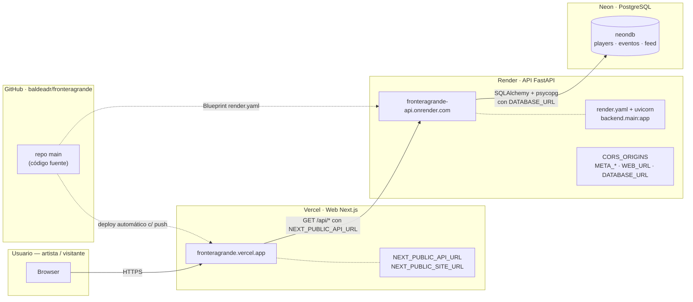

# Despliegue en línea (free tier) — Frontera Grande

Guía para llevar el sitio a internet **gratis o casi gratis**. El dominio
final `fronteragrande.mx` ya está registrado en Cloudflare y apunta a Vercel.

> **Estado: ✔ DESPLEGADO en línea (2026-08).** La web y la API están públicas
> bajo `fronteragrande.mx` y `fronteragrande-api.onrender.com` (ver tabla). La conexión con Meta ya está activa
> en producción y Apex Ultra quedó verificado. Falta programar la sincronización
> automática de publicaciones.

Checklist de despliegue (✔ = hecho, ☐ = pendiente):

| Paso | Estado |
|---|---|
| 1. Repo en GitHub | ✔ `baldeadr/fronteragrande` |
| 2. Neon con datos semilla | ✔ 29 artistas, 11 eventos |
| 3. API en Render | ✔ `fronteragrande-api` (health `{"estado":"ok"}`) |
| 4. Fotos y feed de YouTube | ✔ 20 con foto · 64 videos |
| 5. Web en Vercel | ✔ `fronteragrande.mx` (`fronteragrande.vercel.app` como alternativa) |
| 6. Conexión Meta (verificado) | ✔ app configurada; Apex Ultra verificado |
| 7. UptimeRobot (mantener API despierta) | ☐ pendiente de crear monitor |
| 8. Dominio `fronteragrande.mx` | ✔ registrado en Cloudflare y conectado a Vercel; vence el 2027-08-20 |

## Cómo están conectados los servicios



```
Navegador ──HTTPS──> Vercel (web) ──GET /api/*──> Render (API) ──SQL──> Neon (PostgreSQL)
    ▲                                                            ▲
    └── celdas de Meta (OAuth, sección 6) ──hacia Render─────────┘
GitHub ─deploy automático─> Vercel + Render (leyendo render.yaml)
UptimeRobot ─ping 14 min─> Render (mantiene la API despierta)
```

Arquitectura en producción:

| Pieza | Plataforma | Costo | Dominio (prueba) |
|---|---|---|---|
| Web (Next.js) | **Vercel** | $0 | `https://fronteragrande.vercel.app` |
| API (FastAPI) | **Render** | $0* | `https://fronteragrande-api.onrender.com` |
| BD (PostgreSQL) | **Neon** | $0 (0.5 GB) | — |

*En Render free tier el servicio se duerme a los 15 min de inactividad; se
despierta solo (~50 s la primera carga). Un ping automático de
[UptimeRobot](https://uptimerobot.com/) (gratis) cada 14 min lo mantiene
activo.

Archivos de despliegue que ya están en el repo:

- `render.yaml` — blueprint con el servicio web de la API (Render lo lee al
  hacer "New → Blueprint").
- `vercel.json` — fija el framework (`nextjs`); el root dir `web/` se configura
  en el dashboard de Vercel (Project → Settings → Root Directory).
- `requirements-prod.txt` — dependencias mínimas de la API (sin las librerías
  de scripts locales).

## 1. Subir el repo a GitHub

El repo local ya está inicializado en la raíz (`git init` hecho, sin commit).
En github.com crea un repositorio **privado** (o público) llamado
`fronteragrande`, por ejemplo, y luego:

```bash
git add -A
git commit -m "Prepara despliegue: PaaS (Vercel + Render + Neon), CORS configurable, driver psycopg"
git branch -M main
git remote add origin https://github.com/TU_USUARIO/fronteragrande.git
git push -u origin main
```

## 2. Neon (base de datos PostgreSQL)

1. Entra a [neon.com](https://neon.com) (antes neon.tech) → "Create a project" (gratis).
2. Elige región cercana (p. ej. `us-east`).
3. Copia la **connection string** de la rama principal (usa `postgresql://…`
   con password). Guárdala: es `DATABASE_URL`.

## 3. Render (API FastAPI)

1. Entra a [render.com](https://render.com) → **New → Blueprint**.
2. Conecta el repo de GitHub que acabas de subir.
3. Render detecta `render.yaml` y crea el servicio `fronteragrande-api`.
4. En el servicio, entra a **Environment** y define:
   - `DATABASE_URL` = la connection string de Neon.
   - `CORS_ORIGINS` = `https://fronteragrande.mx` (dominio final de la web;
     **sin** `https://` duplicado, separado por comas si hay varios, p. ej.
     `https://fronteragrande.mx,https://www.fronteragrande.mx`).
   - `META_REDIRECT_URI` y `WEB_URL` solo cuando quieras el login de Meta
      (ver paso 6). Si no, dejar vacío es válido.
5. Espera el deploy y anota la URL del servicio: `https://fronteragrande-api.onrender.com`.
6. Verifica: `curl https://fronteragrande-api.onrender.com/api/health` →
   `{"estado":"ok"}`.

> Si el build usa el entorno de la API, Render instala `requirements-prod.txt`
> (rápido). El `startCommand` corre `uvicorn backend.main:app`.
>
> **Importante:** `CORS_ORIGINS` debe incluir el dominio final desde el que se
> sirve la web (`https://fronteragrande.mx`), de lo contrario los fetch del
> navegador (formulario de alta, conexión Meta, suscripción push) serán
> bloqueados por el navegador.

## 4. Cargar los datos semilla en Neon

Desde tu máquina (el venv ya tiene `psycopg` en `requirements.txt`):

```bash
.venv/bin/pip install -r requirements.txt   # la primera vez, incluye psycopg
DATABASE_URL="POSTGRESQL_URL_DE_NEON" .venv/bin/python scripts/seed_db.py
```

Esto crea las tablas y carga los artistas + eventos. El seed es
**insert-if-missing**: si la BD ya tiene datos (altas por formulario,
verificación, actividad), no los pisa. Para reconstruir desde cero usar
`scripts/seed_db.py --reescribir`. Después, **poblarlo de contenido**
(fotos de perfil y videos de YouTube) con los scripts de scraping apuntando a
Neon:

```bash
# Fotos de perfil desde las redes (URLs, sin descargar)
DATABASE_URL="…" .venv/bin/python scripts/actualizar_imagenes.py

# Últimos videos de YouTube (RSS, sin API key) → alimenta el feed
DATABASE_URL="…" .venv/bin/python scripts/actualizar_feed_youtube.py

# Suscriptores y vistas públicas (requiere YOUTUBE_API_KEY)
DATABASE_URL="…" YOUTUBE_API_KEY="…" .venv/bin/python scripts/sync_youtube_stats.py
```

> Re-ejecutar estos scripts refresca fotos/feed (las URLs de redes pueden
> caducar). `DATABASE_URL` se puede poner en `.env` y así no repetir el prefijo.

Verifica:
```bash
DATABASE_URL="POSTGRESQL_URL_DE_NEON" .venv/bin/python \
  -c "from lib.repository import ArtistRepository; from db.database import SessionLocal; s=SessionLocal(); print(len(ArtistRepository(s).todos()))"
```

> **Fuente de verdad:** la BD de Neon es la única fuente de verdad operativa.
> Los `data/*.csv` del repo son **bootstrap + export**: se regeneran desde la
> BD con `scripts/exportar_csv.py` (respaldo y sync con architecting-a-band).
> Para que la BD local muestre lo mismo que la web, reconstruirla desde
> producción: `DATABASE_URL="<neon>" ./scripts/sync_local.sh`.

## 5. Vercel (web Next.js)

1. Entra a [vercel.com](https://vercel.com) → **Add New → Project**.
2. Importa el repo de GitHub. Configura el **Root Directory** en `web/`
   (Project → Settings) antes del primer deploy.
3. En **Environment Variables** define:
   - `NEXT_PUBLIC_API_URL` = `https://fronteragrande-api.onrender.com`
   - `NEXT_PUBLIC_SITE_URL` = tu dominio de Vercel (o `https://fronteragrande.mx`
     cuando exista). El sitemap/robots/metadatos lo usan.
4. **Deploy**. Al terminar, la web queda en `https://fronteragrande.vercel.app`.

## 6. Conectar Meta (login y verificación de artistas)

El OAuth de Meta exige **HTTPS** y una URL de callback fija. En producción ya
está configurado con la app de Meta de Frontera Grande:

- `META_APP_ID` y `META_APP_SECRET` (las credenciales de la app de Meta) +
  `META_REDIRECT_URI` = `https://fronteragrande-api.onrender.com/api/feed/igfb/callback`
  (Registrar esa URI en la app de Meta: developers.facebook.com → Valid OAuth
  Redirect URIs).
- `WEB_URL` = `https://fronteragrande.vercel.app` (adónde regresa el flujo).
- Para artistas reales habría que solicitar la **revisión de la app**
  (Business Verification); en modo desarrollo solo funciona con el admin.

> Si `META_APP_ID`/`META_APP_SECRET` están vacías, la API responde
> `igfb.configurado: false` y el botón "Conectar con Meta" no aparece en el
> perfil del artista.

Para la prueba con unos pocos artistas, puedes saltarte este paso.

## 7. Sincronizar publicaciones de Meta

La verificación del artista y la sincronización de publicaciones son procesos
separados. El workflow `.github/workflows/sync-meta.yml` ejecuta
`scripts/sync_feed_igfb.py` manualmente o cada 6 horas mediante GitHub Actions.

En GitHub, entra a **Settings → Secrets and variables → Actions** y crea estos
secretos del repositorio:

- `DATABASE_URL`: connection string de Neon.
- `META_APP_ID`: App ID de Meta.
- `META_APP_SECRET`: App Secret de Meta.

Para ejecutar una sincronización histórica: entra a **Actions → Sincronizar
publicaciones de Meta → Run workflow** y deja `50` en **Publicaciones por
artista**. El workflow automático usa `10` publicaciones por ciclo para
detectar novedades sin hacer consultas innecesarias. El resultado se puede
revisar en el resumen y los logs de esa ejecución. No pegues estos valores en
el código ni en los logs.

El horario `0 */6 * * *` significa que GitHub intentará ejecutarlo cada seis
horas. GitHub puede retrasar unos minutos los workflows programados.

## 8. Mantener viva la API (opcional pero recomendado)

1. Crea una cuenta gratis en [UptimeRobot](https://uptimerobot.com/).
2. Nuevo monitor HTTP(S) → URL de la API (`/api/health`) → intervalo **14 minutos**.
3. Listo: mientras UptimeRobot pinguee, Render no se duerme.

> **Pendiente:** con la misma cuenta de UptimeRobot se crea el monitor para
> `https://fronteragrande-api.onrender.com/api/health`.

## 9. Dominio `fronteragrande.mx`

El dominio se registró en Cloudflare el 2026-08-20 por **$30.70 USD por
un año**. Su vencimiento es el **2027-08-20**. En Vercel, `fronteragrande.mx`
está conectado al entorno de producción y los DNS se mantienen administrados
por Cloudflare.

La web usa `https://fronteragrande.mx` como URL pública principal; el dominio
gratuito `fronteragrande.vercel.app` continúa disponible como dirección
alternativa.

## 10. Correo oficial `@fronteragrande.mx`

Se usa el dominio del propio Cloudflare (Email Routing) para recibir correos:
`info@fronteragrande.mx` reenvía a `dhadaniel@gmail.com` (sin costo).
El envío como `@fronteragrande.mx` sigue pendiente (SMTP de Zoho gratis).
Guía completa: [docs/email.md](docs/email.md).

---

## Verificación tras desplegar

```bash
curl -s https://fronteragrande-api.onrender.com/api/health        # {"estado":"ok"}
curl -s https://fronteragrande-api.onrender.com/api/artists        # lista JSON
curl -s https://fronteragrande-api.onrender.com/api/feed           # feed
curl -s https://fronteragrande.mx                                  # HTML de la portada
```
